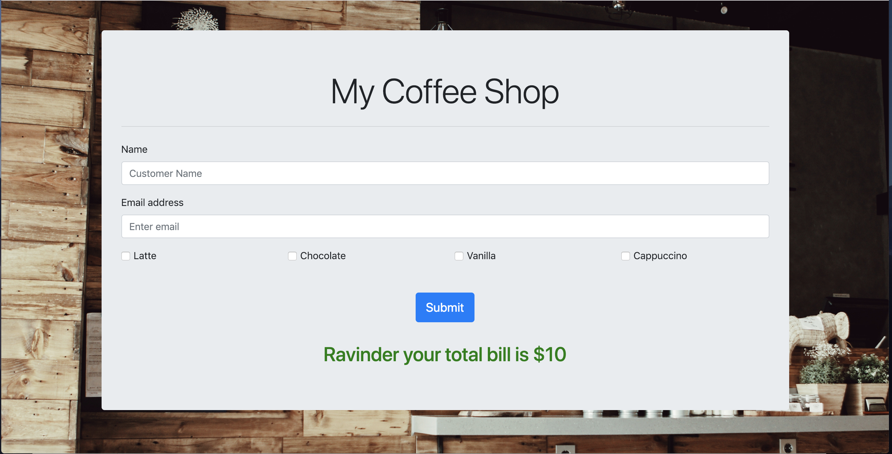
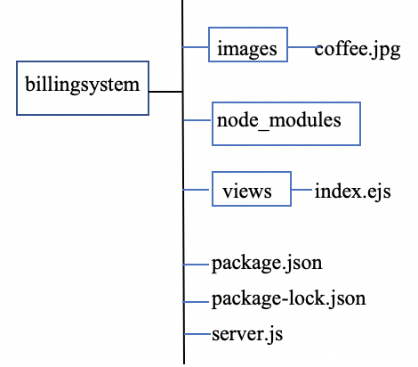

# [ Tutorial ]()
**Tutorial Guide for making Simple Billing Application using Node.js and Express:**

In this tutorial, I am going to build the billing system of a coffee shop. In this application, I am going to use node.js and express framework, bootstrap, html and embedded JavaScript. I am not going to use any database for storing data, I am actually making use of data.json file which holds the array of items I want to display on my browser screen. First, I would like to give you brief description of the technology that I am using in this application, after that we will actually start building the practical code:

**Node.js:** It provides runtime environment for JavaScript code. It enables us to use asynchronous programming. To understand this concept let’s take an example of synchronous coding with PHP, if one task is going on, the system is not able to take another request, it will process the next task only when one completes. So, this means user have to wait, but Node.js eliminates the waiting, and simply continues with the next request.Node.js runs single-threaded, asynchronously programming, which makes it very memory efficient.

**Express:** It is the web-application framework of node.js that provides access to useful API’s and middleware. Middleware are basically a piece of code that access the request, can send respond and also have access to next request. It also has views that are used to display the user interface. For view you can just make use of static page like HTML or JavaScript file. For this project I am making use of embedded JavaScript File (ejs).

**To give you a glimpse of my end result, Following are the snapshots of output screen:**

-When you will fill the following form and select the coffee you want, it will generate the result showing your filled name along with the bill for your coffee.

 Now we will start building our project:
 
- Before building this app, there are some pre-installations required. You need:

**Node.js:** To download node.js package and install this on your system, follow this site: [https://nodejs.org/en/download/](https://nodejs.org/en/download/)

**NPM:** It stands for node package management. Install it from [https://www.npmjs.com/get-npm](https://www.npmjs.com/get-npm)

To check whether installations are done successfully or not, open terminal (for mac) or cmd (for windows) and type:

**node -v and npm -v** These commands would return version of your installed softwares and indicate they are installed successfully.

**Express:** You not need it now, but to install express open terminal and type:
        **npm install express –save**

**Editor:** I am using visual studio code to write my code.

The file structure that I am using is:

Create a folder on your desktop with name “billingsystem” and open it in visual studio code.
Now add a file to this folder with name “server.js”, which acts as an entry port for your project. Now you need package.json which contains all your dependencies you are using in your project. A package.json file must contain "name" and "version" fields.
- To build package.json file, open your system terminal or the terminal of VS code and type:
- npm init -y
- You will get file like below:

